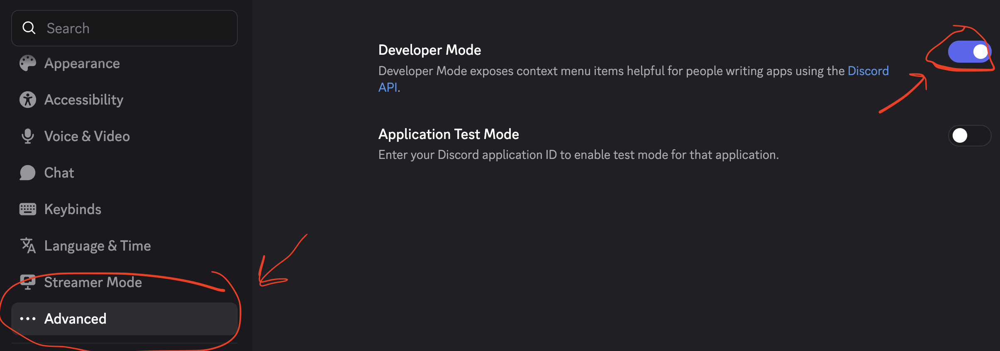
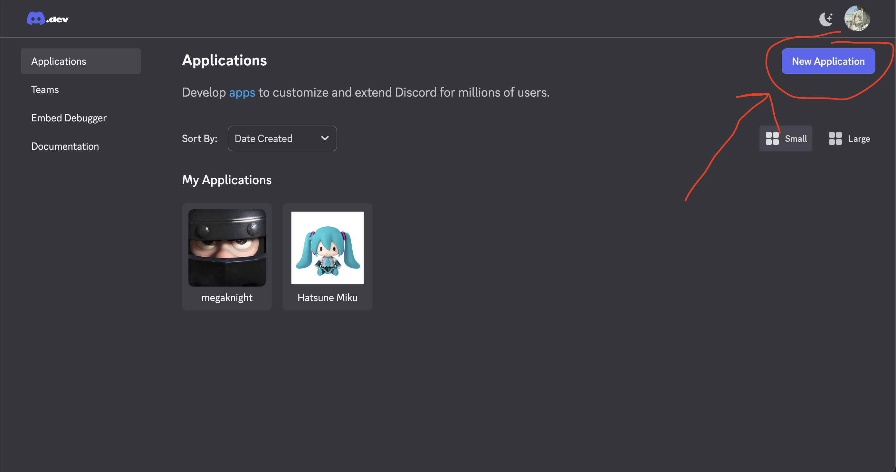
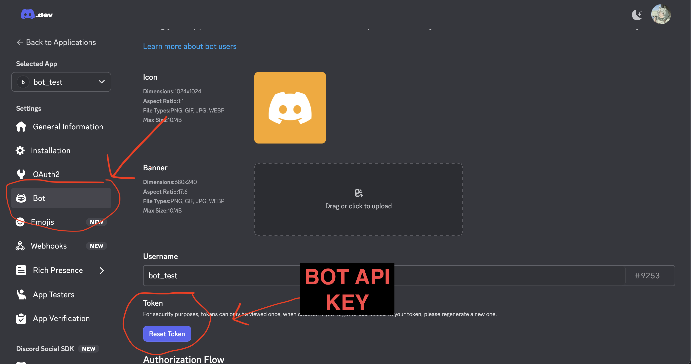
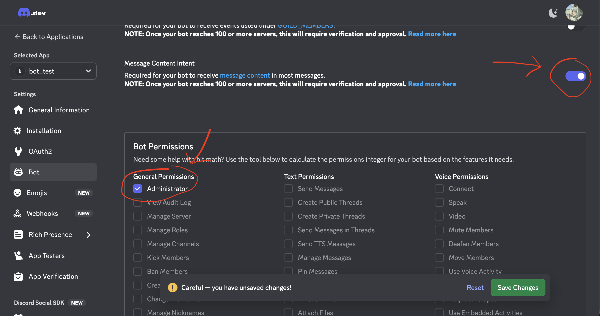
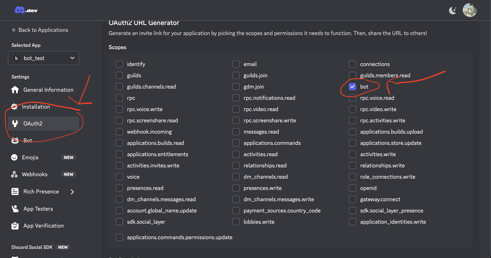
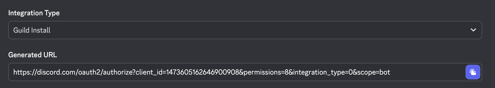

# HatsuneMiku discord bot
A locally hosted discord bot for playing music with your friends. 

## Installation Guide 
You will need a discord bot API key and server id. 
Ensure any version of python 3.10+ is installed. 
A spotify API key is necessary to play spotify related links.  
Bot will still function without a spotify API key. 
### Getting userid and server id
Enable developer mode in the discord user settings

Then right click on your profile to copy user id, and right click on desired server and click on copy server id.
### Discord API setup

Click to expand

On the discord developer [homepage](https://discord.com/developers/applications) click on new application and set a name for the bot

Once the new application is created click on bot under settings, then reset token and copy this down(IMPORTANT DO NOT SHARE THIS!!)

Under the same page scroll down and enable message content intent, and for bot permissions select administrator(Don't forget to save settings)

Then under settings click on OAuth2 and select bot under Scopes

Under the same page scroll down to bot permissions then select Administrator

Finally at the bottom of the page select guild install for integration type and open the link under generated URL and select the server you want to add the bot(Must have manage server perms)

### Windows setup
Run `scripts/windows_botsetup.ps1`,  
then to start the bot run `scripts/winrun_bot.ps1`. 

### Linux/Mac setup
Install `ffmpeg`. 
Install `deno` or any other javascript runtime/engine(Dependency for yt-dlp)  
Run `scripts/bash_botsetup.sh`, 
then to start the bot run `scripts/bashrun_bot.sh`. 
