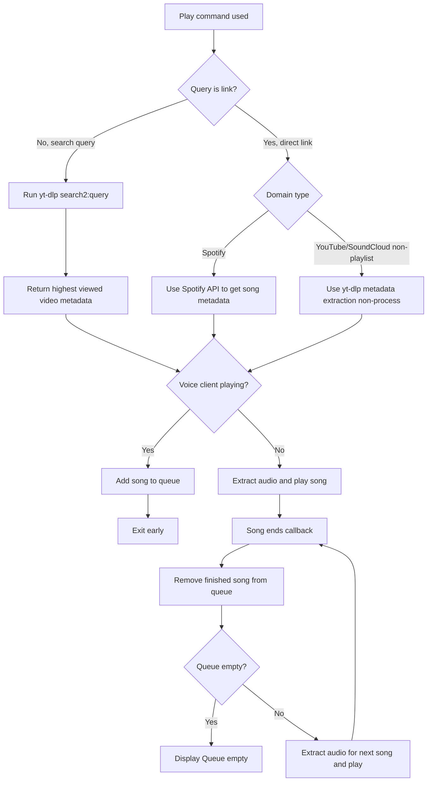

# How bot audio is generated and played

## Song lifetime

Text explantation

1. Play command used
1. Check if query is link or search (Regex)
1. Search &rarr; `yt-dlp search2:{query}` &rarr; return highest viewed video metadata
1. Link &rarr; Separate by domain 
a. Spotify &rarr; Spotify API to get song metadata 
b. YT/Soundcloud(non-playlist) &rarr; YT-dlp to get song metadata (non-process for faster extraction) 
1. Check Guildplayback state VC 
a. VC playing? &rarr; Add to queue &rarr; Exit early 
b. VC not playing? &rarr; Extract audio &rarr; Play song
1. Song ends &rarr; Song callback function called 
a. Removed finished song from queue 
b. Queue empty? Yes &rarr; display Queue empty to users 
c. Queue empty? No &rarr; Extract audio from next song 
1. Repeat step 6 until queue empty

